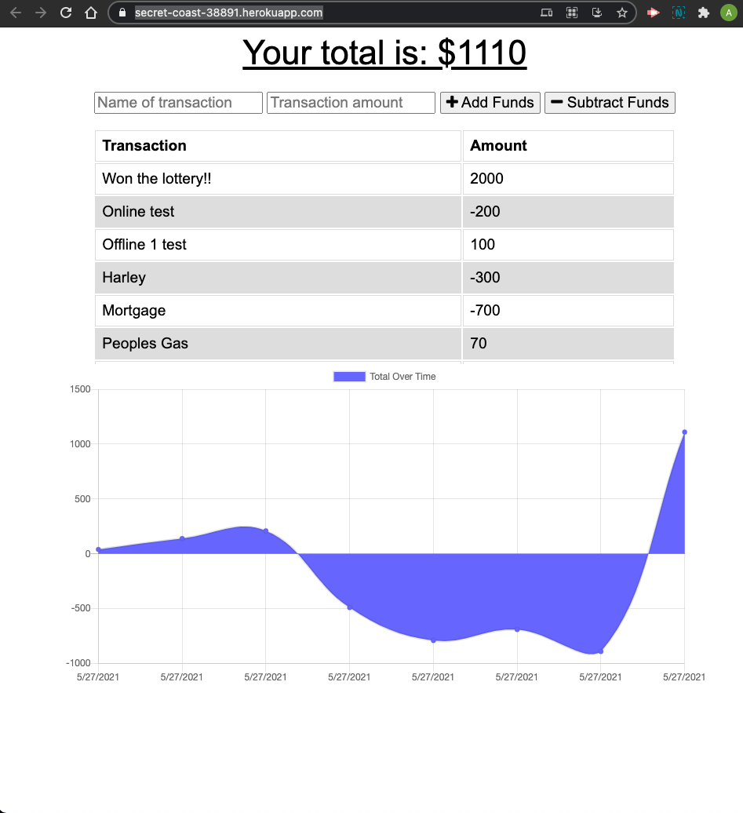

# Online/Offline Budget Tracker

## Description
    The Online/Offline Budget Tracker is an application that allow for offline access and functionality. The user is able to add expenses and deposits to their budget with or without a connection. When entering transactions offline, they should populate the total when brought back online.

## Story
    This app is perfect for users that enjoys to track their spending habits. A user is able to track withdrawals 
    and deposits with or without a data/internet connection so that the users account balance is accurate when they 
    are traveling regardless of an internet connection.

## License

## Deployment
[Progressive Budget Tracker ](https://secret-coast-38891.herokuapp.com/)
This app is deployed live on Heroku! (Click Link!)

## Demo
